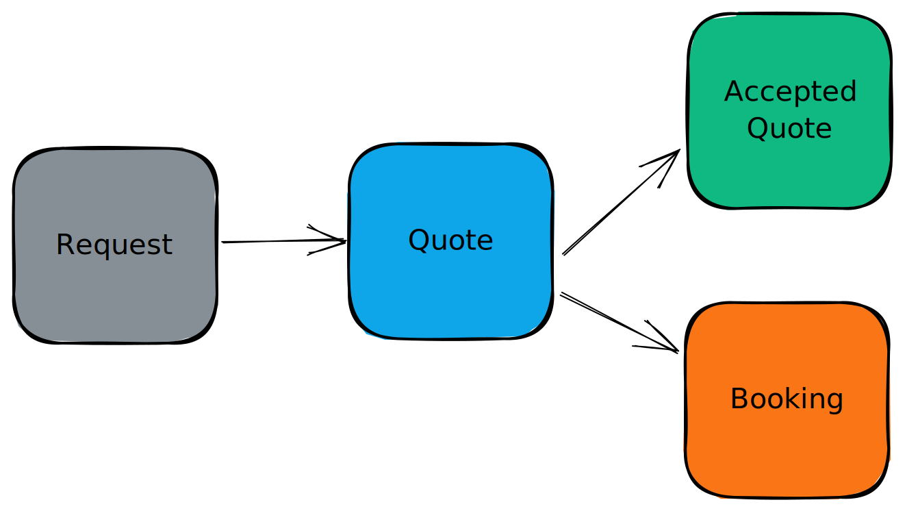

# 🤷‍♀️ Concepts

## Job flow 

AeroQuote uses a job flow that follows the order below.

### Requests

AeroQuote's Requests feature is the easy and efficient way to start creating fast, accurate air charter quotes for your entire fleet. Requests are where you record your customers' charter requests, but that's only the start.  With just a few clicks, you can enter your customer's travel details and see automated charter price estimates.  Your estimates even automatically include ferry costs to provide more accurate pricing estimates. If you are a Broker, your Request module shows you estimated costs and you can send request-for-quotes in bulk with the click of a button.

With AeroQuote's Requests feature, you can take the guesswork out of pricing and get charter estimates that are just right for your customers.

### &#x20; Quotes

Quotes are the central piece of the AeroQuote system and are where you will spend most of your time. You can generate a quote manually, or automatically from a [Request](concepts.md#requests).

#### Options

Each Quote you generate will have one or more Options.  These are sections in your quote where you can provide your customers with prices for different types of aircraft, all in the same quote.  Options are very flexible, you can even create Options without any flights for times when you want to provide things like accommodation or transport packages for your clients.

#### Online Quote view

AeroQuote's online customer quote view is a valuable addition to any air charter quoting workflow. Give your customers real-time, online access to information about your quotes. With this feature, you can provide an online version of your quote, giving customers access to all the details, photos, maps, and notes they need to make informed decisions. Customers can browse the options you have provided and make selections on their preferred aircraft. AeroQuote event provides an online and offline question-and-answer chat feature. When the customer has decided on their proffered option, they can agree to your terms and conditions and accept your quote, all online.

### Bookings

Bookings (for Operator subscriptions only) is the natural next step from an Accepted [Quote](concepts.md#quotes).  Bookings provide a concise view of your itinerary.

#### Crew Allocation

Assign crew from your user database to a Booking. Once an allocation has been made, your crew will receive an email notifying them of the booking. The crew may view the upcoming and past bookings by logging into AeroQuote

#### Passenger Allocation

Add passenger information and assign them to some or all of the flight legs. Passenger details like contact information and weights are available to view for you and your crew assigned to the booking.

#### Job Status

You may update the status of a job from **Boarding** -> **In-Progress** -> **Completed** or **Cancelled.**

These statuses are reflected in the Online Booking View for your customers.

#### Online Booking View

AeroQuote's online customer booking view gives your customers real-time, online access to information about their booking. They will see the current itinerary, flight status, flight leg details, photos, maps, and notes. Customers can browse the options you have provided and make selections on their preferred aircraft. Like the [online quote view](concepts.md#online-quote-view), AeroQuote provides a question-and-answer chat feature where your customers can ask questions and view answers. 

