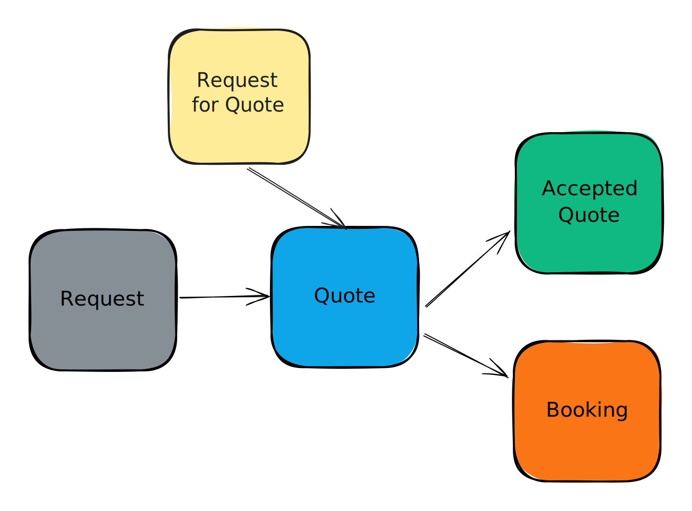

# 🤷‍♀️ Concepts

These are the core ideas you will see across AeroQuote — the shared vocabulary for how charter (and related) work moves from enquiry to completed flight. This page is conceptual: for step-by-step how-tos, follow the links into the guides.

## Operators and Brokers

AeroQuote accounts are built around an **operator** (your company). Within that account you may work primarily as:

| Role | Typical focus |
| --- | --- |
| **Operator** | You fly your own fleet. You quote from aircraft you control and, with the Bookings module, manage confirmed flights end-to-end. |
| **Broker** | You source aircraft from other companies. You use **External Operators**, **RFQ** (Request for Quote), and estimated costs rather than only your own fleet. |

Some accounts mix both. The same job flow (Request → Quote → Booking) applies; brokers lean more on RFQ and external aircraft.

## Modules

**Modules** turn major product areas on or off for your account (Settings → Modules). Free modules can be toggled immediately; paid modules require a subscription confirmation.

Common modules you will meet by name:

| Module | What it unlocks (conceptually) |
| --- | --- |
| **Bookings & Flight Tracking** | Bookings, crew/passenger ops, flight tracking, analytics, and related operational tools (paid) |
| **Request for Quote (RFQ)** | Broker-style bulk RFQs to external operators (free; often included on broker plans) |
| **Scheduled Flights (RPT)** | Seat-selling on published routes and a public storefront (paid; depends on Bookings) |
| **FTL / Crew Limits** | Flight- and duty-time compliance tracking for crew (enabled separately when available) |

If a feature is module-dependent, it is noted below. See [Modules](../guides/settings/modules.md) for enabling and billing detail.

## Job flow 

For whole-aircraft charter work, AeroQuote follows this job flow:

### Requests

**Requests** record inbound charter enquiries. You capture the customer, passenger count, notes, and itinerary, and AeroQuote produces **live price estimates** across your fleet (including ferry/positioning where relevant).

From a request you can generate a [Quote](concepts.md#quotes) with pre-filled legs and aircraft. Brokers also use the request as the starting point to send [Requests for Quote (RFQ)](concepts.md#external-operators-and-rfq) to external operators.

Requests have simple pipeline statuses (for example Active, Call Back, Not Interested, or Quote Already Created).

**Guides:** [Requests](../guides/requests/README.md) · [Using the Estimator](../guides/requests/using-the-estimator.md)

### Quotes

**Quotes** are the commercial heart of AeroQuote. You create a quote from a [Request](concepts.md#requests) or from scratch, attach documents and terms, and send a single professional proposal to the customer.

A quote is not limited to one aircraft price. AeroQuote is built so you can show **multiple aircraft prices on the same quote**. We call each priced alternative an **[Option](concepts.md#options)**.

Quotes are where you spend most of your quoting time: itinerary, costs, margins, options, document layout, validity dates, and customer communications.

**Guides:** [Quotes](../guides/quotes/README.md) · [Creating a Quote from scratch](../guides/quotes/creating-a-quote.md) · [Create Your First Quote](create-your-first-quote.md)

#### Options 

AeroQuote supports showing **multiple aircraft prices to a customer on the same quote**. We call these **options**.

When you build a quote from a [request](concepts.md#requests) or from scratch, you can select **one or more aircraft** to include. Each selected aircraft becomes its own **option** on that quote — with its own cost estimate, pricing, and (where relevant) itinerary details such as ferry legs. The customer receives **one** quote link, but can compare the options you chose to put in front of them.

| Idea | What it means |
| --- | --- |
| **One quote** | One commercial proposal, one validity period, one customer conversation |
| **One or more options** | Each option is a priced alternative on that proposal — usually a different aircraft |
| **Customer choice** | On the [online quote view](concepts.md#online-quote-view), the customer can compare options and accept the one they want |

**How options usually appear in your workflow**

1. Capture the trip as a **Request** (or start a quote from scratch).
2. Review fleet **estimates** for that itinerary.
3. Select the aircraft you want the customer to see — one aircraft for a single-option quote, or several to offer a real choice.
4. Generate the quote: AeroQuote creates an **option per selected aircraft**.
5. Adjust price, costs, or document content per option as needed, then send.

You can also add options that are not aircraft-only packages when you need non-flight line items (for example accommodation or ground transport), but the everyday meaning of “option” for most operators is: **another aircraft price on the same quote**.


If you only select one aircraft, the quote still has one option — you do not need multiple options for every job. Multi-option quotes are for when you want the customer to compare aircraft (or packages) side by side.


**Guides:** [Create Your First Quote](create-your-first-quote.md) · [Creating a Request (operators)](../guides/requests/creating-a-request-operators.md) · [Edit the price of a quote option](../guides/quotes/edit-the-price-of-a-quote.md)

#### Online Quote view

The **online quote view** is the customer-facing web page for a quote. Customers can review itinerary details, photos, maps, notes, and the **options** you offered; ask questions via chat; and, when you require it, accept your terms and conditions and accept a preferred option online.

**Guides:** [Require T&Cs to be accepted online](../guides/quotes/require-t-and-cs-to-be-accepted-online.md) · [Customer Pages Branding](../guides/settings/customer-pages-branding.md)

### Bookings

**Bookings** are confirmed flights — the operational step after an accepted [Quote](concepts.md#quotes). You can also create a booking from scratch when there is no prior quote.


Bookings require the **Bookings & Flight Tracking** module (a paid add-on). See [Modules](../guides/settings/modules.md).


A booking holds the itinerary, aircraft, crew, passengers, cargo, status, communications, and change history. Scheduled-flight departures (when that module is enabled) are also backed by bookings so the same operational tools apply.

**Guides:** [Bookings](../guides/bookings-operators/README.md) · [Create a Booking from a Quote](../guides/bookings-operators/create-a-booking-from-a-quote.md)

#### Crew Assignment

**Crew assignment** attaches staff (pilots and cabin crew) from your [Staff](concepts.md#staff) list to a booking. Assigned crew can be notified by email and can open the booking in the web app or [mobile app](concepts.md#mobile-app).

**Guide:** [Crew Assignment](../guides/bookings-operators/crew-assignment.md)

#### Passengers and Cargo

**Passengers** and **cargo** are assigned to flight legs with weights and details used for payload awareness and manifests. Passenger records often come from your [Contacts](concepts.md#contacts) database.

**Guide:** [Passengers & Cargo](../guides/bookings-operators/passengers-and-cargo.md)

#### Flight Status

Each flight leg moves through a simple status lifecycle, for example **Boarding** → **In Progress** → **Completed**, or **Cancelled**. Status can be set by crew (mobile app) or updated automatically when [Flight Tracking](concepts.md#flight-tracking) is enabled. Status is visible on the bookings dashboard and on the [online booking view](concepts.md#online-booking-view).

**Guide:** [Booking Status](../guides/bookings-operators/booking-status.md)

#### Online Booking View

The **online booking view** is the customer-facing page for a confirmed booking. Customers see the current itinerary, flight status, leg details, photos, maps, notes, and can use chat to ask questions — the same Q&A pattern as the online quote view, but for an active booking rather than a proposal.

**Guide:** [Customer Pages Branding](../guides/settings/customer-pages-branding.md)

#### Amendments

**Amendments** are the full audit trail of changes on a booking — who changed what, when, and (optionally) why. Use them for operational clarity, disputes, and compliance record-keeping.

**Guide:** [Amendments](../guides/bookings-operators/amendments.md)

#### General Items

**General items** are non-flight line items on a booking itinerary (catering, ground transport, overnight fees, custom charges). They can appear on customer-facing communications when you mark them visible.

**Guide:** [General Items](../guides/bookings-operators/general-items.md)

#### Flight Tracking

**Flight Tracking** connects bookings to live aircraft data (primarily FlightRadar24). Departures, arrivals, ETAs, and flight paths can update automatically; crew can confirm or override times from the mobile app. Tracking requires the Bookings module (or modules that include bookings access) and the Flight Tracking toggle under Settings → Integrations.

**Guides:** [Flight Tracking](../guides/bookings-operators/flight-tracking/README.md) · [Integrations](../guides/settings/integrations.md)

## Aircraft

**Aircraft** are the fleet records you quote and fly: registration, type, homebase, performance, costings, images, and (for brokers) links to [External Operators](concepts.md#external-operators-and-rfq). Accurate performance and cost data drive the estimator and quote pricing.

**Guides:** [Aircraft](../guides/aircraft/README.md) · [Add Your First Aircraft](add-your-first-aircraft.md)

## Contacts

**Contacts** are your customer and passenger database. They are the main people on requests, quotes, and bookings, and can be imported in bulk. When a contact is used as a passenger, keeping weight and details up to date improves payload calculations.

**Guide:** [Contacts](../guides/contacts/README.md)

## Staff

**Staff** are team members on your account — people who log in, and/or people available as crew for booking assignment. Roles and permissions control what each person can do in AeroQuote.

**Guide:** [Staff](../guides/staff/README.md)

## External Operators and RFQ

**External Operators** are other aviation businesses in your network (typically charter operators you work with). You can associate them with aircraft in your database so RFQs can be generated automatically when those aircraft appear on quotes.

A **Request for Quote (RFQ)** is the message (and tracking workflow) you send to external operators to obtain pricing. RFQ is controlled by the free **RFQ module** and is central for brokers.

**Guides:** [External Operators](../guides/external-operators/README.md) · [Request For Quote](../guides/request-for-quote/README.md)

## Facilities and Custom Items

**Facilities** are FBOs or meeting points attached to airports on a flight leg. Customers see where to meet on online views; crew see handling details on operational documents.

**Custom items** extend AeroQuote data for your operation: custom airports, custom facilities, custom routes (and route library), and custom charge/duration overrides where configured.

**Guides:** [Using Facilities](../guides/quotes/using-facilities.md) · [Custom Items](../guides/custom-items/README.md)

## Analytics

**Analytics** (under the Bookings area) summarises operational performance over a period you choose — booking volumes, status mix, top routes, on-time performance, and fleet utilisation. It requires the Bookings module and appropriate permissions.

**Guide:** [Understanding Analytics](../guides/analytics/understanding-analytics.md)

## AI Co-Worker

The **AI Co-Worker** is the chat assistant available on every page (chat bubble or top-bar help icon). It answers questions from this help centre, looks up your own data (quotes, bookings, and more), and can perform actions after you confirm them. Admins can teach company-specific procedures via Company Knowledge.

**Guide:** [AI Co-Worker](../guides/dashboard/ai-assistant.md)

## Mobile App

The **AeroQuote Crew** mobile app is for pilots, crew, and ops staff in the field. The same AeroQuote login syncs bookings, passenger check-in, flight status, offline work, and push notifications. Crew confirmations of times take priority over automatic tracking sources.

**Guide:** [Mobile App](../guides/mobile-app/README.md)

## Flight Time Limits (FTL)

**FTL / Crew Limits** tracks crew duty, flight hours, and compliance against profiles when the capability is enabled for your account (Settings → Modules). It depends on accurate crew assignment and block times on bookings.

**Guide:** [Flight Time Limits](../guides/ftl/README.md)

## Scheduled Flights

**Scheduled Flights** (RPT) is a paid module for selling **seats** on recurring routes via a branded storefront, rather than quoting the whole aircraft. Published departures still materialise as [Bookings](concepts.md#bookings), so crew, manifests, tracking, and the mobile app work the same way as charter.


Requires the Bookings module plus the Scheduled Flights module. Enable both under Settings → Modules when available on your plan.


## Accounting Integration

**Accounting integration** connects AeroQuote to **Xero** or **QuickBooks Online** so you can generate invoices from accepted quotes (draft first, then push when ready) and track payment status without re-keying line items. Only one accounting platform is active at a time.

**Guide:** [Accounting Integration](../guides/accounting-integration/README.md)

---

Ready for hands-on setup? Continue with the [Account Setup Guide](account-setup-guide.md), [Add Your First Aircraft](add-your-first-aircraft.md), or [Create Your First Quote](create-your-first-quote.md).
