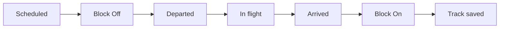

# Automatic Detection (FlightRadar24)

When flight tracking is enabled, AeroQuote polls FlightRadar24 every **two minutes** for eligible legs. Detection runs in the background — no crew action required unless you want to confirm a pushed notification.

---

## Timeline of a single leg

| Event | How it is detected |
| --- | --- |
| **Block off** | Ground movement: speed above taxi threshold, low altitude, at or near departure airport |
| **Departed** | Aircraft becomes airborne; takeoff time refined from FR24 flight summary when available |
| **In-flight position** | Live lat/lng, altitude, speed, heading — stored every ~2 min while leg is in progress |
| **ETA updates** | FR24 ETA written at roughly ⅓, ½, and ⅔ of planned leg duration |
| **Arrived** | Near destination (geofence), or low/slow on approach, or aircraft disappears from feed late in the leg |
| **Block on** | Estimated ~10 minutes after arrival if crew do not record it manually (background job) |
| **Track saved** | Dense FR24 track fetched a few minutes after arrival — powers itinerary maps |

---

## Departure monitoring window

AeroQuote starts looking for departures from shortly before scheduled time through several hours after — and continues watching **stalled rotation legs** (multi-leg bookings in Ground Time) for up to **two days** after a leg's scheduled departure.

### Mid-leg coverage recovery

In remote areas ADS-B coverage often **starts mid-route**. When FR24 first shows an aircraft clearly **between** the leg's departure and arrival airports (but not at the gate), AeroQuote:

1. Stores the live position
2. Estimates the departure time from progress along the route
3. Records **Departed** with source **FlightRadar24**

This prevents a leg from staying blank when the aircraft departed but was never seen on the ground at the origin.

---

## In-flight polling intensity

| Situation | Polling behaviour |
| --- | --- |
| **Bookings Dashboard or Flight Board open** | Full position trail every ~2 minutes |
| **No ops display open** | Lighter polling — ETA milestones and arrival checks only |

Opening the [Bookings Dashboard](../../dashboard/bookings-dashboard.md) signals that your team wants live trails on the map.

---

## Arrival when coverage drops

If the aircraft vanishes from FR24 late in the leg (common approaching remote strips), AeroQuote may record arrival when:

* The feed has no position for several consecutive polls **after** most of the planned duration has elapsed, **and**
* Earlier FR24 positions exist on that leg

The arrival time defaults to the last known position timestamp.

---

## Notifications

| Event | Mobile notification |
| --- | --- |
| **Departure** | Visible push — crew confirm or adjust |
| **Arrival** | Visible push — crew confirm or adjust |
| **Block off (FR24)** | Silent sync — app refreshes |
| **ETA update (FR24)** | Silent sync — app refreshes |

Crew-confirmed times from the app **lock** that milestone — later FR24 updates will not overwrite them.

---

## Saved flight tracks

After FR24 arrival detection, AeroQuote fetches the complete track (retries if FR24 has not finished processing). When saved:

* **Track Saved** badge appears on the Status tab
* Itinerary and dashboard maps show the **actual path flown**
* Mobile **track** API serves points to the app map

Straight-line planned routes are replaced on list views once `track_saved` is set.

---

## Estimated positions (scheduled flights)

On **scheduled routes** with **Auto run departures** enabled, AeroQuote can draw a simulated straight-line track between airports when FR24 has not reported a position in the last few minutes. These points are labelled **(estimated)** on the Flight Board and dashboard.

Charter bookings do not use auto-run simulation; they rely on FR24, crew GPS/manual updates, or [inferred milestones](multi-leg-rotations.md) when a rotation stalls.

---

## Manual and GPS sources

Crew can always:

* Confirm block off, departure, arrival, block on manually
* Log GPS positions during flight (useful without ADS-B)
* Set or update ETA and ETD from the app

See [Flight Status (Mobile)](../../mobile-app/flight-status.md).

---

## Next steps

* [Multi-leg Rotations](multi-leg-rotations.md) — Sequencing, Ground Time, inference, expiry
* [Booking Status](../booking-status.md) — Status tab in the booking UI