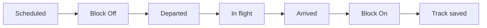

# Automatic Detection (FlightRadar24)

When flight tracking is enabled, AeroQuote polls FlightRadar24 every **two minutes** for eligible legs. Detection runs in the background — no crew action required unless you want to confirm a pushed notification.

---

## Timeline of a single leg

```mermaid
flowchart LR
    A[Scheduled] --> B[Block Off]
    B --> C[Departed]
    C --> D[In flight]
    D --> E[Arrived]
    E --> F[Block On]
    F --> G[Track saved]
```

| Event | How it is detected |
| --- | --- |
| **Block off** | Ground movement: speed above taxi threshold, low altitude, at or near departure airport |
| **Departed** | Aircraft becomes airborne; takeoff time refined from FR24 flight summary when available |
| **In-flight position** | Live lat/lng, altitude, speed, heading — stored every ~2 min while leg is in progress |
| **ETA updates** | FR24 ETA written at roughly ⅓, ½, and ⅔ of planned leg duration |
| **Arrived** | Near destination (geofence), or low/slow on approach, or aircraft disappears from feed late in the leg |
| **Block on** | Estimated ~10 minutes after arrival if crew do not record it manually (background job) |
| **Track saved** | Dense FR24 track fetched a few minutes after arrival — powers itinerary maps |

---

## Planned aircraft on the booked route

The two-minute poll follows the tail already on the leg. Separately, AeroQuote asks FlightRadar24 which aircraft has a flight **from this leg's origin to its destination**.

That check runs a few times before departure, not on every position poll:

* About **four hours** before the scheduled departure
* Again inside **two hours**, if the earlier check found no plan
* Once more inside the **last 45 minutes**, if there is still no plan

A leg that has already left the gate is left alone. Hyphens in the registration are ignored, so `VH-DVW` and `VHDVW` are the same aircraft, and the tail has to belong to **your** fleet.

| FlightRadar24 shows | What AeroQuote does |
| --- | --- |
| Only the tail already assigned | Leaves the aircraft as it is. No email. |
| One other fleet tail, not already on an open booking that day | Swaps **this leg only**, emails you, and notifies crew already on the leg. |
| One other fleet tail that is already on another open booking the same day | Does **not** swap. Emails you and names both bookings. |
| More than one of your aircraft on that route | Does **not** swap. The email lists the registrations. |
| A registration that is not in your fleet | Does **not** swap. The email tells you the registration so you can add it or ignore it. |
| No plan filed yet | No email. A later check can still find one. |

"The same day" is the calendar day at the **departure airport**. An empty leg with one free fleet tail on the plan is assigned. Crew are notified only when an existing tail is replaced.


The swap does not move that aircraft onto another booking, change the airports, change the crew, or email passengers. If the detected tail is already booked, AeroQuote stops and emails you so a person can decide.


The message is **Flight plan aircraft change**, under **Settings → Notifications → Booking events**. Email is on unless you turn that event off. It links to the booking. The subject says whether the aircraft was swapped, held, ambiguous, unknown, or filed to a different destination.

On a scheduled departure, a swap is also written on the departure **Activity** card: "Aircraft … assigned from flight plan".

### Filed destination does not match the booking

If the aircraft you are following has a FlightRadar24 plan to a **different arrival airport**, AeroQuote does not mark the leg arrived from that flight, and it does not change the booked airports. You receive one **Flight plan aircraft change** email.

A live position whose **departure** airport is not this leg's origin is not attached to the leg either. The booked route stays as you entered it.

---

## Departure monitoring window

AeroQuote starts looking for departures from shortly before scheduled time through several hours after — and continues watching **stalled rotation legs** (multi-leg bookings in Ground Time) for up to **two days** after a leg's scheduled departure.

Legs whose departure was **inferred** from the schedule stay in this watch too — if FR24 later detects the aircraft, the estimated time is replaced with the **real takeoff time** from the flight record.

### Mid-leg coverage recovery

In remote areas ADS-B coverage often **starts mid-route**. When FR24 first shows an aircraft clearly **between** the leg's departure and arrival airports (but not at the gate), AeroQuote:

1. Stores the live position
2. Estimates the departure time from progress along the route
3. Records **Departed** with source **FlightRadar24**

This prevents a leg from staying blank when the aircraft departed but was never seen on the ground at the origin.

---

## In-flight polling intensity

| Situation | Polling behaviour |
| --- | --- |
| **Bookings Dashboard or Flight Board open** | Full position trail every ~2 minutes |
| **No ops display open** | Lighter polling — ETA milestones and arrival checks only |

Opening the [Bookings Dashboard](../../dashboard/bookings-dashboard.md) signals that your team wants live trails on the map.

---

## Arrival when coverage drops

If the aircraft vanishes from FR24 late in the leg (common approaching remote strips), AeroQuote may record arrival when:

* The feed has no position for several consecutive polls **after** most of the planned duration has elapsed, **and**
* Earlier FR24 positions exist on that leg

The arrival time defaults to the last known position timestamp.

---

## Notifications

| Event | Mobile notification |
| --- | --- |
| **Departure** | Visible push — crew confirm or adjust |
| **Arrival** | Visible push — crew confirm or adjust |
| **Block off (FR24)** | Silent sync — app refreshes |
| **ETA update (FR24)** | Silent sync — app refreshes |

Crew-confirmed times from the app **lock** that milestone — later FR24 updates will not overwrite them.

---

## Saved flight tracks

After FR24 arrival detection, AeroQuote fetches the complete track (retries if FR24 has not finished processing). When saved:

* **Track Saved** badge appears on the Status tab
* Itinerary and dashboard maps show the **actual path flown**
* Mobile **track** API serves points to the app map

Straight-line planned routes are replaced on list views once `track_saved` is set.

---

## Estimated positions (scheduled flights)

On **scheduled routes** with **Auto run departures** enabled, AeroQuote can draw a simulated straight-line track between airports when FR24 has not reported a position in the last few minutes. These points are labelled **(estimated)** on the Flight Board and dashboard. See the [Scheduled Flights guides](../../scheduled-flights/README.md) for the module itself.

Charter bookings do not use auto-run simulation; they rely on FR24, crew GPS/manual updates, or [inferred milestones](multi-leg-rotations.md) when a rotation stalls.

---

## Manual and GPS sources

Crew can always:

* Confirm block off, departure, arrival, block on manually
* Log GPS positions during flight (useful without ADS-B)
* Set or update ETA and ETD from the app

See [Flight Status (Mobile)](../../mobile-app/flight-status.md).

---

## Next steps

* [Multi-leg Rotations](multi-leg-rotations.md) — Sequencing, Ground Time, inference, expiry
* [Booking Status](../booking-status.md) — Status tab in the booking UI