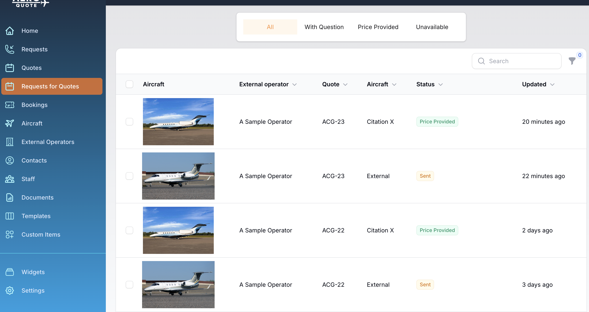

# Custom Airports

## Steps to create a custom airport

1. Navigate to Custom Items and click **Add Custom Location**
2. In the window that appears, give the new location a name you will remember.
3. Click Next
4. Drag the pin and use the zoom controls to center the pin over the custom location
5. Or enter an address or even latitude and longitude and drag the pin for fine changes.

<figure><figcaption></figcaption></figure>

6. Click Save to create the new airport.  You may search for your airport anywhere you see a departure or arrival location box.

<figure><figcaption></figcaption></figure>
