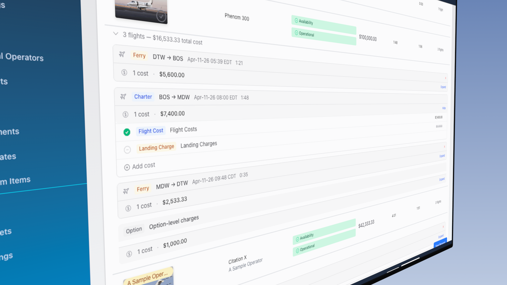

# Cost Management

AeroQuote now gives you full visibility and control over every cost that makes up a quote. Each flight, ground time, and option displays an itemised cost breakdown that you can expand, edit, and customise — starting from the estimate stage, before a quote is even created.

***

## What's New

Previously, flight costs were summarised as a single total. With this update:

* Every cost is displayed as its own **line item** (flight costs, landing charges, parking charges, fuel uplifts, per-passenger charges, and more)
* Cost breakdowns are available at the **estimate stage** — before a quote is created
* You can **add custom costs** to any flight or option
* You can **toggle individual costs** on or off without deleting them
* You can **edit amounts** on any cost item
* You can **control customer visibility** — choose exactly which costs appear on customer quotes and PDFs
* You can **remove ferry flights** from estimates
* **Per-passenger charges** are now shown as a separate line item
* **Ground time charges** now appear as a separate row between flights in the itinerary
* Cost breakdowns carry through from **estimates to quotes to bookings** automatically
* **Automatic price updates** — for aircraft using margin-based pricing, the option price recalculates automatically when you change costs

***

## Estimate-Stage Cost Breakdown

Cost breakdowns are now visible at the estimate stage — on both the **Requests** page and the **Quote Builder** — before a quote is created.

### Viewing Flight Costs on Estimates

When you calculate estimates for a request, each aircraft option shows all charter and ferry flights with an expandable cost breakdown:

<figure><figcaption></figcaption></figure>

1. Go to **Requests** and open a request
2. Add your flight details and let the estimates calculate
3. Under each aircraft, click the flight summary row (e.g. "3 flights — $16,533 total cost") to expand
4. Each flight is listed with its type (Charter or Ferry), route, departure time, and duration
5. Click the cost summary bar on any flight (e.g. "2 costs — $4,343") to expand individual cost items

Each cost item shows:

* A colour-coded **type badge** (Flight Cost, Landing Charge, Parking Charge, Per Passenger Charge, etc.)
* The cost **name** and **amount**
* A **toggle** to include or exclude the cost from the total

Option-level charges (day charges, overnight charges) appear in a separate section below the flights.

### Editing Costs at the Estimate Stage

You can edit, add, toggle, and delete costs before generating a quote:

* **Edit**: Click the pencil icon on any cost item to change its name or amount
* **Add**: Click **Add cost**  to create a custom cost item on any flight
* **Toggle**: Click the check/minus icon  to include or exclude a cost
* **Delete**: Click the trash icon on custom (non-system) cost items

All changes update the aircraft option's total cost in real time. If the aircraft uses margin-based pricing, the option price is also recalculated automatically and you'll see a notification showing the old and new price. When you generate a quote, your edited costs carry through to the quote's cost items.


If you change the charter flights (add, remove, or modify a route), the estimates recalculate from scratch and any cost edits will be reset.


### Removing Ferry Flights

The estimator automatically adds ferry flights when an aircraft needs to reposition (e.g. fly from its homebase to the charter departure point). You can remove unwanted ferry flights:

1. Expand the flights under an aircraft option
2. Find a ferry flight (marked with an amber **Ferry** badge)
3. Click the **X** button on the right side of the ferry flight row 
4. The ferry flight is removed and all totals (cost and ferry time) update immediately


Removed ferry flights will reappear if the estimates are recalculated (e.g. when you add or change a charter flight), since the flight plan has changed.


### Per-Passenger Charges

If an aircraft has per-passenger sector charges configured, these now appear as a separate **Per Passenger Charge** line item on each charter flight, rather than being hidden inside the flight cost total. This makes it easy to see and adjust passenger-related costs independently.

***

## Viewing Cost Breakdowns on Quotes

### On a Flight Item

Each flight item in your quote now has an expandable cost section.

1. Open a quote and navigate to the **Options** tab
2. Find a flight item card
3. Click the cost summary bar (e.g. "3 costs — $1,250") to expand

<figure><figcaption></figcaption></figure>

When expanded, you'll see each cost line item:

| Column     | Description                                            |
| ---------- | ------------------------------------------------------ |
| **Name**   | The cost type (e.g. "Flight Costs", "Landing Charges") |
| **Amount** | The cost in your operator currency                     |
| **Toggle** | Include or exclude this cost from the total            |

### On an Option

Option-level costs (day charges, overnight charges, and custom charges) appear in a separate cost section below the flight items within the option.

<figure><figcaption></figcaption></figure>

***

## Adding a Custom Cost

You can add your own cost items to any flight or option:

1. Expand the cost breakdown on a flight item or option
2. Click **Add Cost**
3. Enter:
   * **Name** — A description (e.g. "Handling Fee", "De-icing")
   * **Amount** — The cost in dollars.
4. Click **Save**

The new cost is immediately included in the flight and option totals.


Custom costs you add are marked differently from system-generated costs. You can edit or delete custom costs at any time. System-generated costs can be toggled off but not deleted.


***

## Editing a Cost Amount

1. Expand the cost breakdown
2. Click the amount field on any cost item
3. Enter the new amount
4. The total recalculates automatically


Editing a system-generated cost (like landing charges) will override the calculated value. If you recalculate the flight, the system value will be restored.



For margin-based aircraft, the option price will automatically update to reflect the new cost. You'll see a notification with the old and new price.


***

## Toggling Costs On or Off



Each cost item has a toggle to include or exclude it from the total:

1. Expand the cost breakdown
2. Click the toggle next to any cost item
3. The flight and option totals update immediately

This is useful when you want to:

* Temporarily exclude a cost for a special quote
* See the impact of individual costs on the total
* Keep a cost on record without including it in the price

***

## Customer Visibility

You can control which cost items are visible to your customers on their quote page and PDF. By default, all costs are **hidden** from customers — the customer only sees the **total price**.

### Toggling Customer Visibility

1. Expand the cost breakdown on a flight item
2. Hover over a cost item to reveal the **eye icon** 
3. Click the eye icon to toggle visibility:
   * **Blue eye** — visible to the customer (icon stays visible persistently)
   * **Grey eye-slash** — hidden from the customer (icon appears on hover only)

### What the Customer Sees

When one or more cost items are marked as visible, a **Included Costs** section appears on the customer's quote page. This section shows only the costs you've chosen to share — along with the cost name, amount, and any explanatory notes.

<figure><figcaption></figcaption></figure>


Customer visibility only controls what is **displayed** to the customer. Hidden costs are still included in the total cost — they are not excluded from costings.



**Use visibility strategically** — Share costs like landing charges or fuel uplift to justify your pricing, while keeping internal costs like maintenance reserves private.


### Visibility on PDFs

The same visibility rules apply to quote PDFs. Only cost items marked as visible will appear on the generated PDF, regardless of which PDF variant you use.

***

## Automatic Price Recalculation

When you edit costs on a quote option that uses a **margin-based** aircraft, AeroQuote automatically recalculates the option price using the aircraft's configured margin percentage.

### How It Works

1. You add, edit, toggle, or delete a cost item on a flight or option
2. The option's total cost updates
3. If the aircraft has a **price margin** configured (not hourly rates), the price recalculates: **price = cost + (cost × margin%)**
4. A notification appears showing the previous price and the new price

### When It Doesn't Apply

* **Hourly-rate aircraft** — Price is based on flight duration, not costs, so it doesn't change when costs are edited
* **Cost overridden** — If you've manually overridden the option cost, neither cost nor price will auto-recalculate
* **Manual price edits** — Only automatic cost changes trigger recalculation; editing the price directly in the option modal works as before


The margin percentage used comes from the aircraft's pricing configuration. To change it, go to **Aircraft → Costings** and update the price margin.


***

## Ground Time Charges

Ground time charges represent the cost of the aircraft waiting on the ground between flights. These appear as separate rows in the itinerary between consecutive flights.

### How Ground Time is Calculated

1. AeroQuote calculates the time gap between one flight's arrival and the next flight's departure
2. The ground time hourly rate is looked up from the aircraft's sector charges
3. The charge is calculated: **hourly rate x (ground time minutes / 60)**

### Setting Up Ground Time Rates

To configure ground time charging for an aircraft:

1. Go to **Aircraft** from the sidebar
2. Click on an aircraft
3. Navigate to the **Costings** tab
4. Add a **Ground Time** sector charge with an hourly rate


If no ground time rate is configured for an aircraft, no ground time charges will appear.


***

## Cost Summary View (Operators)

The **Summary** step of the quote builder shows a complete cost breakdown for each option:

* Option-level costs (day charges, overnight charges, custom charges)
* Per-flight cost breakdowns with all line items
* Ground time charges between flights
* Total cost per option

This gives you a clear picture of where costs come from before setting your price.

***

## Costs in Bookings

When a quote is converted to a booking, all cost items are automatically copied:

* Flight cost items carry over to the booking flight items
* The same cost breakdown is available on the booking side
* You can view costs on the booking for reference

***

## Tips


**Use the cost breakdown to verify quotes** — Before sending a quote to a customer, expand the costs on each flight to make sure landing charges, fuel, and other costs look correct.


* Add custom costs for items not automatically calculated (handling fees, permits, catering)
* Toggle off costs you've negotiated away rather than deleting them — you'll have a record if you need to add them back
* Check ground time charges on multi-leg trips to make sure the wait time costs are reasonable
* The option total always reflects only the costs that are toggled "on"
