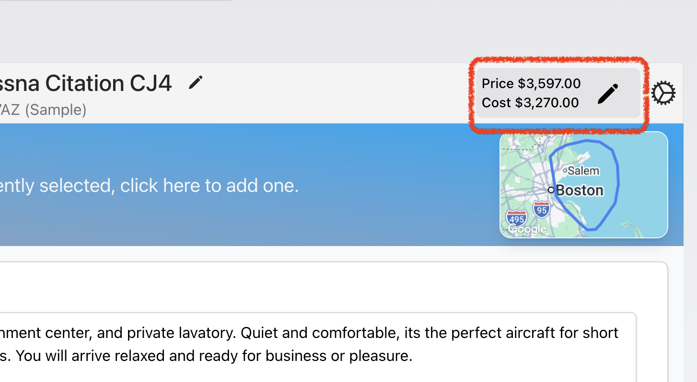

# Edit the Price of a Quote option

Each quote option in AeroQuote has a Price (what your customer pays) and a Cost (what the trip costs you to operate). You can adjust either of these manually at any time — useful for a broker when you receive a cost from your operators, or if you want to apply a discount, override a calculated cost, or quote a margin that differs from the default.

#### Step 1 — Find the Price and Cost panel

Open any quote and locate the option you want to edit. In the top-right corner of the option header you'll see a small panel showing two figures:

&#x20; \- Price — the amount the customer will be charged for this option.

&#x20; \- Cost — your operational cost for the option.

&#x20; Next to these figures is a pencil icon (✏️ ). This is the edit button.

<figure><figcaption></figcaption></figure>


_If the Cost figure has an amber background, it means your current price is lower than your cost — you're quoting at a loss. The system flags this so you can review before sending._&#x20;


#### &#x20; Step 2 — Open the edit window

Click the pencil icon. A window titled "Update Option Cost and Price" will appear..

You'll see two input fields:                                                                                                                                  &#x20;

1\. Option Price for customer — what the customer pays.

2\. Option Cost to you — what the trip costs your business.

#### Step 3 — Adjust the Price

In the Option Price for customer field, type or paste the new amount you want to charge.

The price should normally be equal to or higher than the cost. As you type, the modal shows a live Margin readout below both fields — this updates instantly so you can see exactly what profit (or loss) the new price will produce.


_Minimum customer price: if the aircraft assigned to this option has a configured minimum customer price, the system will not allow the price to drop below it. When the minimum is in effect you'll see "Min. price applied" displayed under the Cost figure on the option card._


#### Step 4 — Adjust the Cost (optional)

In some situations, you may want to override the calculated cost — for example if you've negotiated a special fuel rate for this trip, or you want to absorb part of the operational cost yourself.                                                                                                                        &#x20;

Type the new cost into the Option Cost to you field. As soon as you change this value the cost is treated as manually overridden. AeroQuote will stop recalculating the cost from the underlying flight legs and ground items for this option.

Clearing a cost override                                                                                                                                     If you've previously overridden the cost and want to revert to the system-calculated value, click the Clear Cost Override button that appears beneath the cost field. This restores the cost to whatever AeroQuote calculates from the option's flight and ground items.


_Day cost / Overnight cost: day and overnight crew cost adjustments are no longer made here. They've moved to the option costs list further down on the option card. Look for the General Option Costs section._


#### Step 5 — Review the Margin

Underneath the two input fields, AeroQuote shows the live margin in two formats:

&#x20; \- The dollar margin (Price minus Cost).

&#x20; \- The percentage margin (Price minus Cost, as a percentage of Cost).

&#x20; If the price is below the cost, the margin readout turns amber as a warning.

Use this to sanity-check your changes before saving. There's no need to do the maths in your head — the window updates instantly each time you type.

#### Step 6 — Save

When you're happy with the figures, click Save at the bottom of the modal. The modal closes and the option card updates immediately.

After saving:

&#x20; \- The new Price and Cost are shown in the panel at the top-right of the option.

&#x20; \- If you overrode the cost, a small orange information icon appears next to the Price and Cost panel. Hovering over it displays a tooltip noting that the cost has been manually overridden.

&#x20; \- The same icon also appears if a Day Cost or Overnight Cost has been overridden separately in the General Option Costs list.

&#x20; Frequently asked

> Q: I changed the cost but it doesn't match the General Option Costs list anymore.\
> That's expected. Once you override the option cost, AeroQuote treats your figure as the source of truth and stops summing the line items. Click Clear Cost Override in the edit modal if you want to go back to the calculated figure.

> Q: The price won't go below a certain number.\
> The aircraft has a configured minimum customer price. You'll see a "Min. price applied" label on the option card when this kicks in. If you need to quote lower, an account administrator can adjust the minimum on the aircraft in Settings → Aircraft.

> Q: My margin is showing as amber — what does that mean?\
> Your price is currently lower than your cost, meaning the option will be loss-making at the current figures. AeroQuote highlights this so you can make a deliberate decision before sending the quote.

> Q: Where did the Day Cost and Overnight Cost adjustments go?\
> They moved out of this modal and into the General Option Costs list further down on the option card. You can adjust them there as individual line items, which makes the breakdown easier to read.
