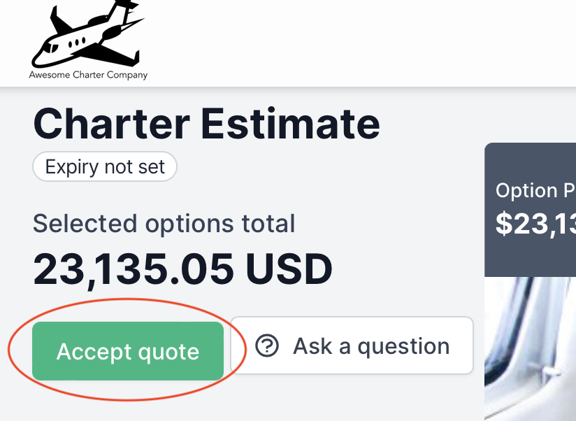
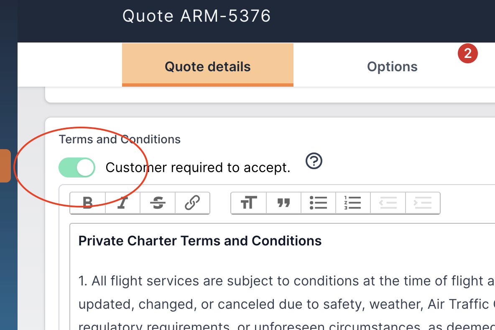

# Require T\&Cs to be accepted online

When your customers view your online quote (link sent in your quote email), they have the ability to select one or more options and accept the quote by clicking Accept Quote.

<figure><figcaption>
The Accept Quote Button
</figcaption></figure>

If you have selected to require the T\&Cs to be accepted, the customer will be presented with a window displaying the Terms and Conditions, and "Cancel" and "Accept" buttons.  To set your quote acceptance to have this behaviour, ensure the "Customer required to accept" switch is on in the **Quote Details** page of any quote.

<figure><figcaption></figcaption></figure>

