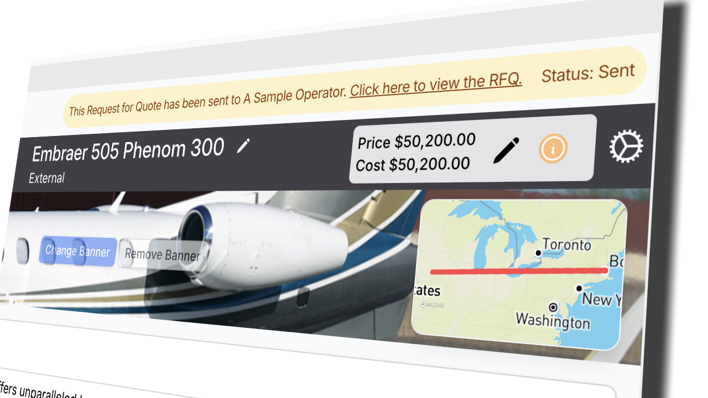

# Track Responses to a RFQ

The status of a RFQ can be monitored in a number of ways.

* [Viewing the RFQ directly from the **Request for Quotes** list and page](track-responses-to-a-rfq.md#method-1-view-the-rfq-status-bar-on-the-option-in-your-quote)
* [Viewing the current status in the information bar above the Option.](track-responses-to-a-rfq.md#method-2-view-all-the-rfqs-in-the-request-for-quotes-menu.-the-status-is-shown-in-the-list)
* [Receiving automated emails from the External Operator.](track-responses-to-a-rfq.md#method-3-receive-automated-emails-from-the-external-operator)

A RFQ status may be one of the following:

| Name               | Meaning                                                     |
| ------------------ | ----------------------------------------------------------- |
| Not Sent           | RFQ generated but not yet sent                              |
| Sent               | RFQ delivered, awaiting response                            |
| Viewed             | External operator has opened the request                    |
| Price Provided     | Operator has submitted a price (your option cost)           |
| Unavailable        | Aircraft not available for the RFQ                          |
| Has Question       | Operator has sent you a question from the online page.      |
| Option has changed | Original quote option has been modified, you should resend. |
| Cancelled          | RFQ has been cancelled                                      |

### To view the current status of a RFQ, you may:

#### Method 1 - view the RFQ status bar on the Option in your Quote:

<figure><figcaption></figcaption></figure>

#### Method 2 - View all the RFQs in the **Request for Quotes** menu.  The status is shown in the list.



#### Method 3 - Receive automated emails from the External Operator.

If the External Operator provides one of the following responses: **Unavailable**, **Question** or **Price Provided**, an email will be sent to your business email with details of the response.

<figure><figcaption>
Sample "Has Queastion" email
</figcaption></figure>

