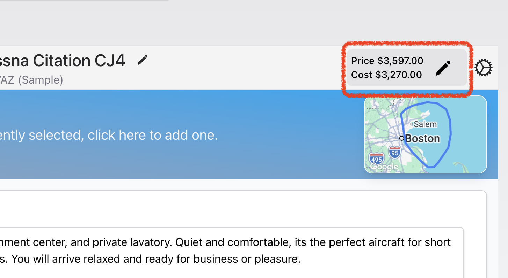

# Viewing and Managing a Request For Quote

### Opening the RFQ page

#### Method 1 - From the Quote Option

The status of a RFQ will always be attached to the Option that uses the External Aircraft.  The banner includes a link to the RFQ, clicking it will open the RFQ page.

<figure><figcaption></figcaption></figure>

#### Method 2 - From the RFQ list page

<figure><figcaption></figcaption></figure>

### Managing a RFQ

[#viewing-the-external-operator-rfq-page](viewing-and-managing-a-request-for-quote.md#viewing-the-external-operator-rfq-page "mention")

[#initial-send](viewing-and-managing-a-request-for-quote.md#initial-send "mention")

[#managing-attachments](viewing-and-managing-a-request-for-quote.md#managing-attachments "mention")

[#question-and-answer-communication](viewing-and-managing-a-request-for-quote.md#question-and-answer-communication "mention")

[#cancelling-an-rfq](viewing-and-managing-a-request-for-quote.md#cancelling-an-rfq "mention")

[#deleting-an-rfq](viewing-and-managing-a-request-for-quote.md#deleting-an-rfq "mention")

#### Viewing the External Operator RFQ page

Clicking the  button will open the External Operator view on a new page.

Use this feature to:

* Review the page before sending
* Interact with the page - the page is the live version the External Operator will use.
* Copy the page URL for sending via other methods (messages apps etc)

#### Initial Send

* Click the "Send Request for Quote" button to open the sending window
* Add optional External Notes that will be included in the email to provide additional context or special instructions
* Click "Send Request" to dispatch the RFQ to the external operator



#### Managing Attachments

The Attachments button (with badge showing count) allows you to:

* View all current attachments associated with the RFQ
* Upload new supporting documents (PDFs, Word docs, Excel files, images, text files)
* Delete existing attachments if needed
* Maximum file size: 10MB per attachment
* Attachments are automatically shared with the external operator on their RFQ page.

<figure><figcaption></figcaption></figure>

#### Question & Answer Communication

When an external operator asks a question:

* Questions appear in the Questions and Answers section
* Click "Add Comment" to respond to a specific question 
* Your response is sent immediately to the external operator
* All communications are logged for reference
* Mark questions as "Answered" to manually mark as resolved instead of adding a comment.

Communication Flow:

1. External operator asks question → You receive notification
2. You reply → External operator receives your response
3. All exchanges are preserved in the conversation thread

<figure><figcaption></figcaption></figure>

#### &#x20;Cancelling an RFQ

To cancel an active RFQ:

1. Click the "Cancel" button 
2. Confirm the cancellation in the popup
3. The external operator will be notified
4. Status changes to "Cancelled"
5. Cannot be reversed - you'll need to create a new RFQ if needed

#### Deleting an RFQ


Warning: This action is permanent and cannot be undone.


1. Click the "Delete" button 
2. Confirm deletion in the modal
3. Removes the RFQ and all associated data
4. No notification is sent to the external operator
5. Prefer to use cancellation instead if the RFQ has already been sent
